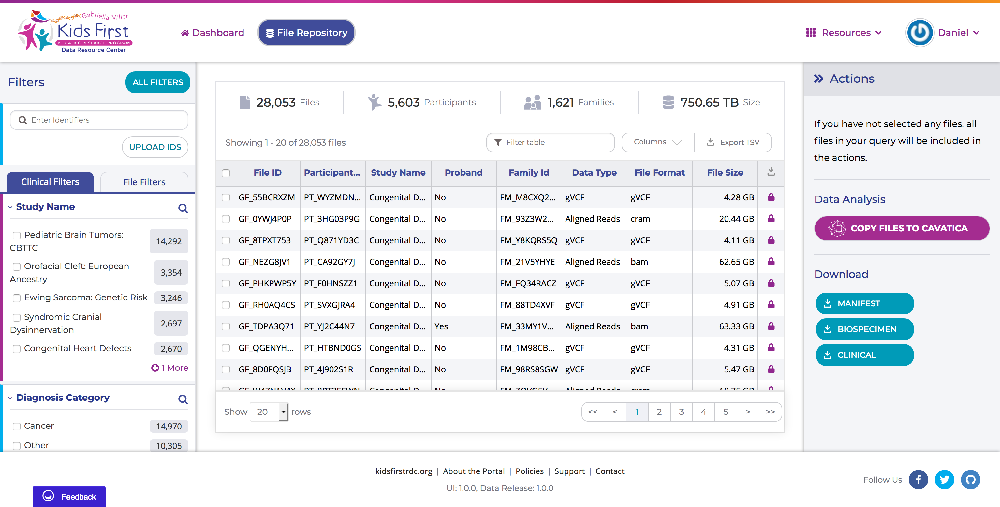

<p align="center">
  
</p>

<p align="center">
  <a href="https://github.com/kids-first/kf-portal-ui/blob/master/LICENSE"></a>
  <a href="https://circleci.com/gh/kids-first/kf-portal-ui"></a>
  <a href="https://app.codacy.com/app/kids-first/kf-portal-ui/dashboard"></a>
</p>

# Kids First Portal

The Kids First Portal powers the file browser and user profile interfaces
using [Arranger](https://github.com/overture-stack/arranger)
and [Persona](https://github.com/overture-stack/persona) services.



## Development

Install dependencies and start the development server:

```
npm i
npm start
```

Please make sure your code has been formatted using [Prettier](https://prettier.io/)

### Service Dependencies

For full functionality, the portal needs to interact with many APIs.
All API endpoints may be set inside the environment.
Copy `.env.schema` to `.env.local` and configure it with appropriate endpoints.

### Contributing

- ### Branches

  All new development should happen on a supporting branch rather than directly on `next` or `master`. Supporting branches should be formatted as `<type>/##-couple-words` or `<type>/very-short-description`, where <type> denotes a change type that is one of the below:

  - feat (feature)
  - bug (bug fix)
  - docs (documentation)
  - refactor
  - test (when adding missing tests)
  - chore (maintain)

  Once development is complete for the scope defined by the supporting branch, a pull request can be made for the `next` branch for code review.

- ### Component Development

  To facilitate parallel development of independent components, [Storybook](https://github.com/storybooks/storybook)(a sandboxed environment for development) is utilized.
  To start a local storybook session:

  - Run the command `npm run storybook`
  - A storybook should be available at `localhost:9001`
  - All stories live under `/stories`, these should only be used for development and demonstrations of components. Imports should only be made from `/src` to `/stories`, never the other way around.
  - ## Setting up environment variables:
    - `NODE_PATH=src/` is required for storybook build to allow absolute references in `src` to resolve properly. This also allows stories to import modules from `src` with absolute references, with `src` being the root directory.
    - All environemnt variables required to run the portal should be exposed to Storybook using the prefix `"STORYBOOK_"`.
      Example: the environment variable `REACT_APP_ARRANGER_API` would be `STORYBOOK_ARRANGER_API`
    - Some UI components may require interactions with APIs guarded by [EGO](https://github.com/overture-stack/ego). To enable these components to access these APIs, an ego jwt must be provided in the `Storybook ego login` story, available once a Storybook instance is running.
    - For an example story, please refer to `/Users/mha/repos/kf-portal-ui/stories/CohortBuilder/index.js`

### Acknowledgement


